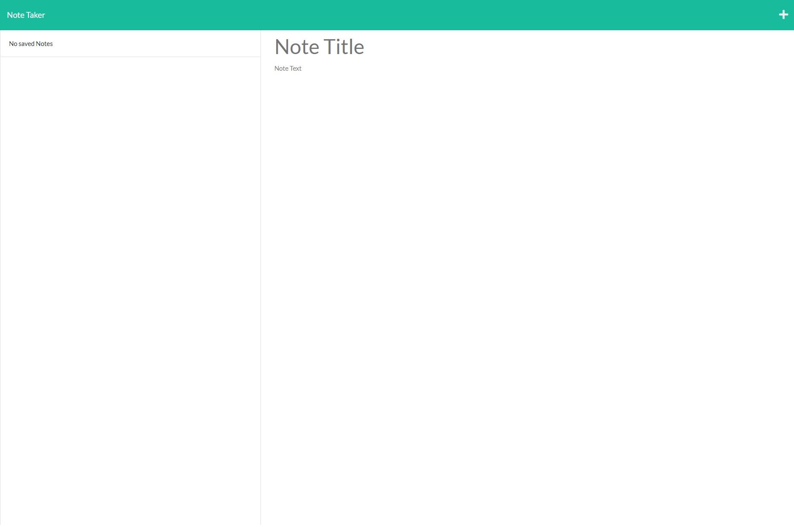
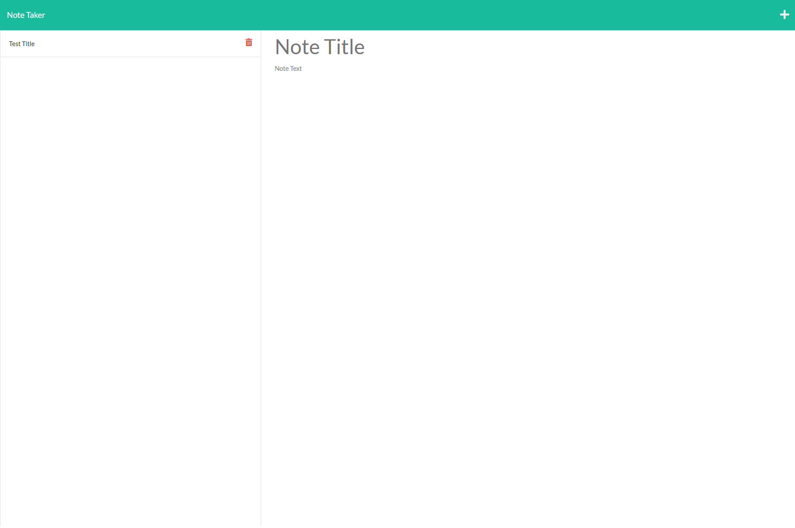
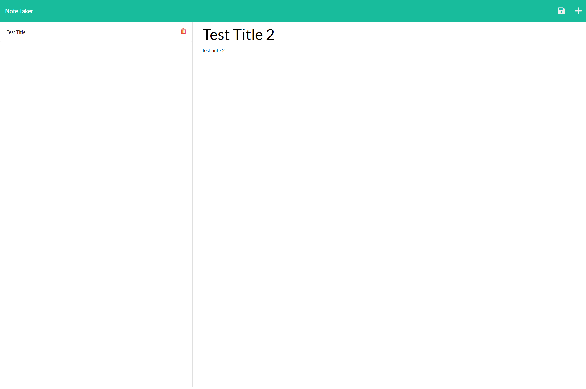
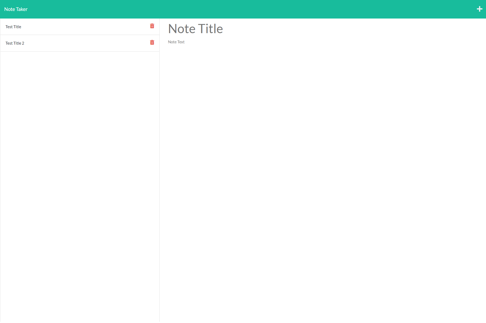

# Note Taker

## Licensing:

## Table of Contents 
- [Description](#description)
- [Installation](#installation)
- [Usage](#usage)
- [License](#license)
- [Contributing](#contributing)
- [Tests](#tests)
- [Questions](#questions)

## Description:
This is a note taker app created in the UW Coding Bootcamp that can be used to write, save, and delete notes. This application uses an express.js backend to save and retrieve note data from a JSON file.

## Installation:
Use a web browser to access the website: https://calm-escarpment-81657.herokuapp.com/

## Usage:
Use a web browser to access the website: https://calm-escarpment-81657.herokuapp.com/

Screenshots of website:

Upon visiting the website you will be taken to a landing page where you can press the Get Started button to go to the note taker.

If there are no saved notes you'll see that displayed on the left-hand side

If there are saved notes you'll see that displayed on the left-hand side and you are able to use the trash can to delete those

In the right-hand side section you can click on Note Title and Note Text then to save press the save button in the upper right-hand side of the page

You note will then be saved to the left-hand side of the page

## License:
MIT

## Contributing:
There was already a starter code provided for this project here: https://github.com/coding-boot-camp/miniature-eureka (which is why your see contributors listed in the repo).

Contributions are welcome through forking my repository.

## Tests:
No tests need.

## Questions:
- Github: [andreahergert](https://github.com/andreahergert)
- Email: ahergert24@hotmail.com 